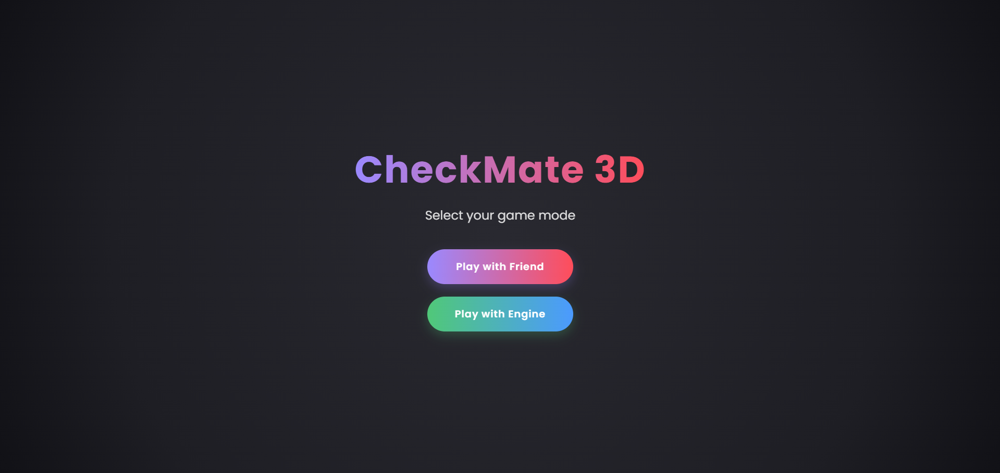
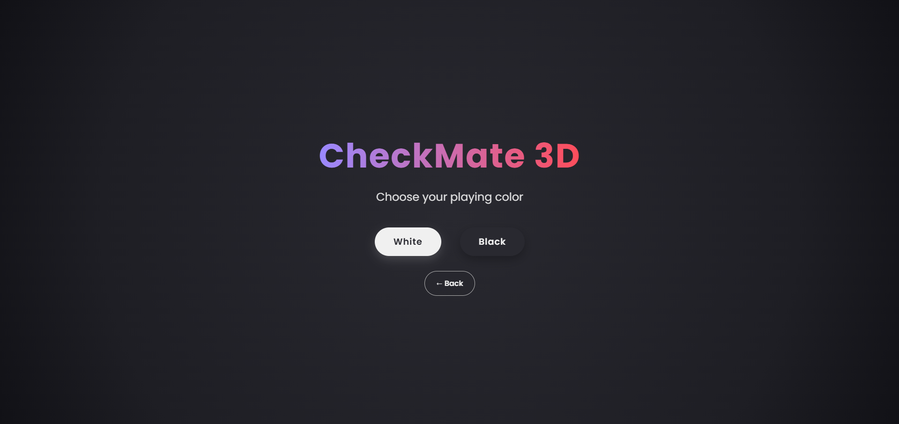
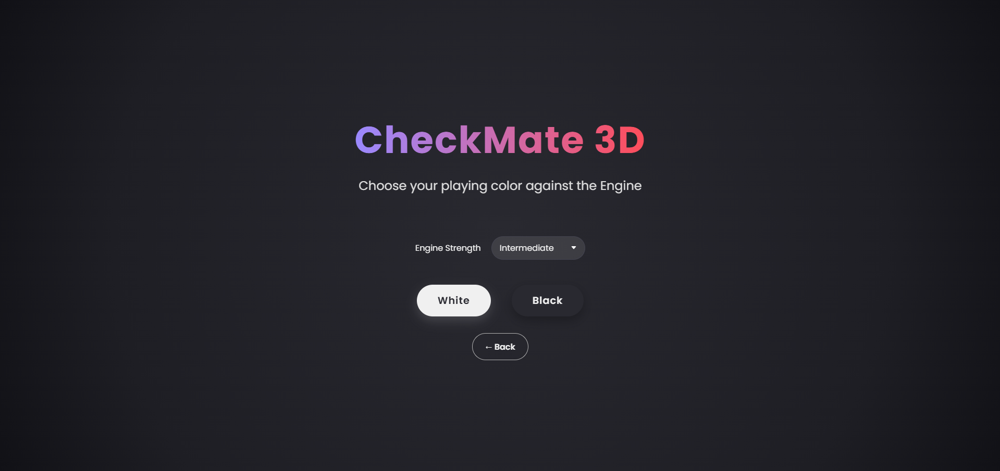
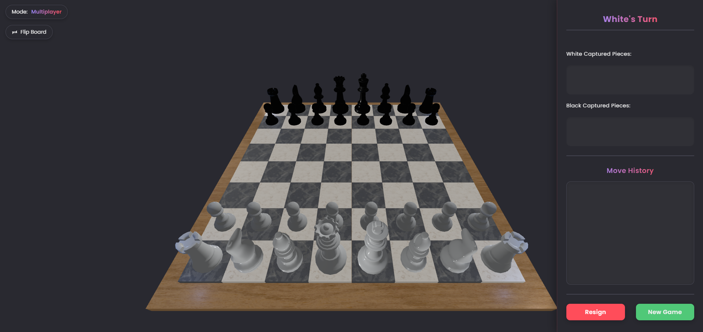
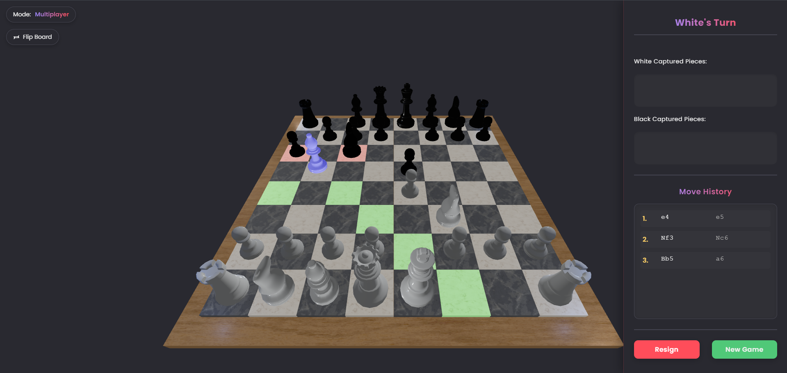
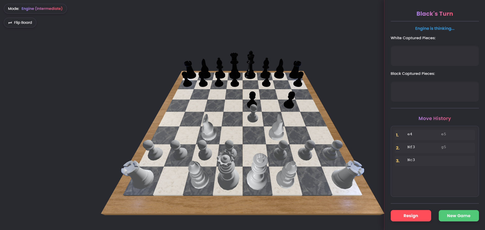

# **Checkmate 3D**
## **Overview**
- **Checkmate 3D is an immersive 3D chess game built using Three.js. It features a fully interactive chessboard with realistic pieces, advanced chess rules, multiple game modes, and smooth animations. Play against a friend in multiplayer mode or challenge the AI at different difficulty levels.
---
## **Features**
- **Game Modes**:
  - Multiplayer mode for playing with friends
  - AI Engine mode with adjustable difficulty (Beginner, Intermediate, Advanced, Expert)
  - Color selection (play as white or black)

- **Complete Chess Rules**:
  - All standard chess moves and rules implemented
  - Special moves: castling, en passant captures, pawn promotion
  - Check and checkmate detection
  - Stalemate recognition
  - Valid move highlighting

- **3D Chessboard & Pieces**:
  - Fully rendered 3D chessboard with detailed pieces
  - Realistic textures and materials
  - Board flipping functionality
  - Highlighted squares for valid moves, captures, and checks

- **Interactive Controls**:
  - Orbit camera for immersive viewing angles
  - Intuitive click-based piece selection and movement
  - Visual and audio feedback for interactions

- **Game Interface**:
  - Turn indicators
  - Move history with algebraic notation
  - Captured pieces display
  - Game status messages
  - Resign and New Game options

- **Sound Effects**:
  - Move sounds
  - Capture sounds
  - Check alerts
  - Castling sounds
  - Error sounds for invalid moves
---
## **Technologies Used**
- **3D Rendering**: Three.js
- **Camera Controls**: OrbitControls for smooth camera movement
- **Model Loading**: GLTFLoader for importing 3D chess piece models
- **Animation**: Custom animation system for piece movements
- **Sound System**: Three.js AudioListener and Audio for sound effects
- **Lighting**: Directional, ambient, and point lighting for realistic scenes
- **Materials**: MeshStandardMaterial with textures, normal maps, and roughness maps
- **Event Handling**: Raycaster for precise piece and square selection
- **Chess Logic**: Custom JavaScript implementation of chess rules and mechanics
---
## **Gameplay Instructions**
### **Starting a Game**
1. **Select Game Mode**:
   - Choose between Multiplayer or Engine mode
   - If playing against the Engine, select the difficulty level

2. **Choose Your Color**:
   - Select white or black pieces
   - White always moves first

### **Game Controls**
1. **Camera Navigation**:
   - Drag to rotate the camera view
   - Zoom in and out using the scroll wheel
   - Use the flip board button to view from the opposite side

2. **Moving Pieces**:
   - Click on a piece to select it (valid moves will be highlighted)
   - Click on a highlighted square to move the selected piece
   - Captures, castling, and special moves are automatically handled

3. **Game Options**:
   - Use the Resign button to forfeit the current game
   - Use the New Game button to start a fresh game

### **Visual Indicators**
- **Green Squares**: Valid moves
- **Red Squares**: Possible captures
- **Blue Squares**: Castling moves
- **Orange Squares**: En passant captures
- **Red Highlight**: King in check
---
## **Project Status**
- **Complete**: Full chess rules and gameplay implemented
- **Ongoing Enhancements**: UI improvements and performance optimizations
---
## **Screenshots**

---
## **Technical Implementation**
- **Chess Logic**: Full implementation of chess rules including special moves
- **FEN Notation**: Support for Forsyth-Edwards Notation for chess positions
- **Raycasting**: Precision detection for piece selection and move targeting
- **Animation System**: Smooth movement with easing functions
- **Sound Management**: Dynamic sound loading and playback
- **Texture Handling**: Multiple textures for realistic materials
- **Lighting System**: Multiple light sources for realistic rendering
---
## **Contributing**
Contributions are welcome! To contribute:
- Fork the repository.
- Implement features or fix issues.
- Submit a pull request.
---
## **License**
This project is licensed under the MIT License. See the LICENSE file for more details.
---
## **Credits**
- **Developer**: Nipun Basnayake 
- **Libraries Used**:
  - Three.js for 3D rendering
  - OrbitControls for camera movement
  - GLTFLoader for model importing
  - Tween.js for animations
---
## **Contact**
For more details, questions, or contributions, feel free to contact:  
- Email: [nipunsathsara1999@gmail.com](mailto:nipunsathsara1999@gmail.com)  
- GitHub: [NipunBasnayake](https://github.com/NipunBasnayake)
